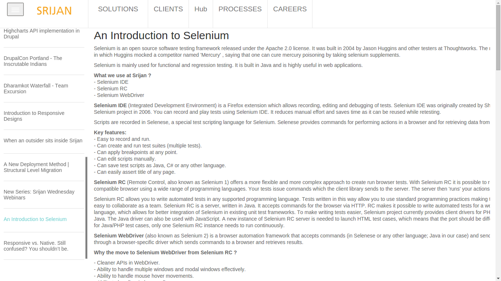

# Sarus <small>Beta</small>

### Check out the [Live Demo](http://sarus-dev.srijanlabs.com)

Sarus is a minimalistic front-end framework for when you need a SEO-friendly continuous scroll across a lot of content. Sarus implements a UX similar to [Quartz](http://qz.com/), and allows for bringing in new content seamlessly on scroll instead of tap/click. Couple that with context-based URL switching, and you got yourself a SEO winner! Sarus is perfect for your blog and any scenario where a continuous flow of content is needed.

Made with love by [@ajsingh92](https://twitter.com/ajsingh92), [@adityaraj](https://twitter.com/adityaraj), [@fotuzlab](https://twitter.com/fotuzlab) and [@ray1claw](https://twitter.com/ray1claw)

## Features

### Fast
Sarus loads data incrementally as you scroll, hence speed to load any post is equal to loading the first post.
### Purely front-end
Sarus is completely independent of the way data is stored in the back-end. It uses an API or RSS feeds to fetch the posts providing complete abstraction between front-end and back-end. This also makes it compatible with apps that use mobile-native/content management/proprietary solutions to store data.
### Easy to set up
Sarus comes with extensive inline documentation to help you integrate it into your system with ease. HTML partials are easy to identify and maintain.
### SEO friendly infinite scroll
Along infinite scroll, Sarus maintains URL paths of posts for the browser. This allows search engines to index your content without hiccups.
### Infinitely customizable
Being based on AngularJS, Sarus allows any level of customization in design and functionality. It is as easy to customize as it is to set up.
### Responsive
Sarus uses twitter bootstrap, and comes responsive out of the box. You can easily either extend it or replace the whole styling component to make it look and feel like you want.
### Maintains browser history
It maintains users' browser history using HTML5 History API. Bookmark and find your visited articles with ease.
### Sharethis
Sharethis comes bundled with it to allow easy sharing across social media.
####Disqus
We are using disqus for discussions on the articles, that gives freedom to the users to put there reviews as well as read others.
## Requirements
Minimum requirement is following tags in feed XML:

`<title></title>`

`<link></link>`

`<description></description>`

For an API call, following urls are required:

> /api/article/1

> /api/slugs/:offset/:count

_These urls are defined in the RSS server script in the bundle. See below._

## Technology Stack

<big>Express</big> - We are using express framework over node-js for our backend application with ejs templating engine.

<big>MongoDB</big> - For database, our choice is mongodb simple and stable for feeds.

<big>Angular-js</big> - Great things, get ignored because of poor UX-UI, Sarus taking advantage of Angular-js javascript MV* framework to provide great UX to its users.

## Installation & configurations
Sarus installation is easy to do. Just follow up with me and in no time sarus will be running on your machine serving a better look and feel for ugly RSS feeds.

First clone the repository to your local machine, open up terminal, reach out into the sarus repo and run
the following command.

>npm install

This will install all the dependencies require for sarus to run.
[In case of error, either you don't have node package manager installed on your machine or you need to run with superuser as sudo npm install]

After installation of dependencies you can directly run the server as

>npm start

open up browser with

>http://localhost:26192

And Sarus will  be there.

###For Configurations

Sarus will be running with default setup. But you can configure it by opening up configuration file located in lib/config/config.js

By using the config file you can tell sarus to where to fetch the feeds, on which port it should be listening, and name of the mongodb database to use.

##Screenshot

##Todo

> Gulp build Automations.

> Code review based on [John Papa's Angular Style Guide](https://github.com/johnpapa/angularjs-styleguide/blob/master/README.md).

Developed by
[@ajsingh92](https://twitter.com/ajsingh92)
[@adityaraj](https://twitter.com/adityaraj)
[@fotuzlab](https://twitter.com/fotuzlab)
[@ray1claw](https://twitter.com/ray1claw)
